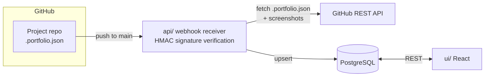

# Portfolio


A full-stack portfolio application that showcases selected GitHub projects, kept in sync automatically through GitHub webhooks.

## Overview

Portfolio content is **synced, not curated**. Any GitHub repository becomes portfolio-eligible by containing a `.portfolio.json` file at its root — a manifest describing the project (name, description, stack, features, screenshots, ...).

- **API** (`api/`) — Spring Boot REST service receiving webhooks and serving project data
- **UI** (`ui/`) — React single-page application rendering the synced portfolio
- **Database** — PostgreSQL storing project records

## How It Works



1. You push to `main` on a project repo containing `.portfolio.json`
2. GitHub fires a `push` webhook at the API
3. The API verifies the request signature (HMAC) and fetches `.portfolio.json` plus preview assets via the GitHub REST API
4. The project record is upserted into PostgreSQL
5. The UI serves the latest data on next load

### Previews

Hybrid approach:

- **Screenshots** — committed to the project repo, referenced by path in `.portfolio.json`
- **Live demo** *(optional)* — a `demo_url` for deployed projects; rendered inline (iframe) or linked, decided at the UI layer

## Tech Stack

| Layer      | Technology                          |
|------------|-------------------------------------|
| Backend    | Java 21, Spring Boot 3              |
| Frontend   | React 18, TypeScript                |
| Database   | PostgreSQL 16                       |
| Integration| GitHub Webhooks                     |

## Planned Structure

```
portfolio/
├── api/    # Spring Boot backend
├── ui/     # React frontend
```

### Prerequisites

- JDK 21
- Node.js 20+
- Docker & Docker Compose

## Roadmap

- [ ] Define the `.portfolio.json` manifest schema
- [ ] Scaffold `api/` (Spring Boot 3 + PostgreSQL + Flyway)
- [ ] Scaffold `ui/` (Vite + React + TypeScript)
- [ ] Webhook receiver with HMAC signature verification
- [ ] Fetch `.portfolio.json` & screenshots via GitHub Contents API
- [ ] Project upsert logic
- [ ] Project list/detail UI with previews
- [ ] Docker Compose for local development
- [ ] CI pipeline

## License

This project is licensed under the [MIT License](LICENSE).
