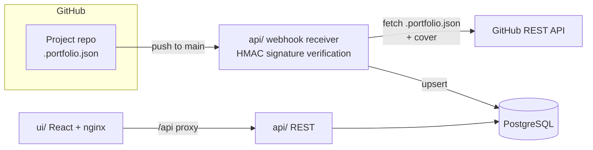

# Portfolio


A full-stack portfolio application that showcases selected GitHub projects, kept in sync automatically through GitHub webhooks.

## Overview

Portfolio content is **synced, not curated**. Any GitHub repository becomes portfolio-eligible by containing a `.portfolio.json` file at its root — a manifest describing the project (name, description, stack, features, cover, ...).

- **API** (`api/`) — Spring Boot REST service receiving webhooks and serving project data
- **UI** (`ui/`) — React single-page application rendering the synced portfolio
- **Database** — PostgreSQL storing project records

## How It Works



1. You push to `main` on a project repo containing `.portfolio.json`
2. GitHub fires a `push` webhook at the API
3. The API verifies the request signature (HMAC) and fetches `.portfolio.json` plus preview assets via the GitHub REST API
4. The project record is upserted into PostgreSQL
5. The UI serves the latest data on next load (with a clearly-labelled demo fallback when the API is unreachable)

### Previews

Hybrid approach:

- **Cover** — one screenshot committed to the project repo, referenced by path in `.portfolio.json` (`cover`, nullable); shown as the card hero image, click opens a zoom viewer
- **Live demo** *(optional)* — a `links.demo` URL opened as an external link, never embedded (most sites block iframing)

## Showcase Repos

How to ready a repo so it renders here. Do this per project repo (docs phase first, sync second).

### Checklist

- Repo is public, or `GITHUB_TOKEN` has read access to it.
- `.portfolio.json` committed at the repo root on `main` (or the `ref` you sync).
- Cover file committed in the same repo/branch when `cover` is set, e.g. `docs/cover.png`.
- Push to `main` (webhook path) or run manual sync (backfill path). Verify with `GET /api/projects`.

### Manifest authoring

Source of truth: `api/src/main/resources/portfolio-manifest-schema.json` (draft 2020-12, `additionalProperties: false`).
A minimal copy-pasteable example lives in `api/src/test/resources/fixtures/manifest-valid.json`.

Required top-level keys: `slug`, `name`, `tagline`, `status`, `role`, `kind`, `period`, `stack`, `repos`, `links`, `highlights`.
`name`/`tagline` are `{ "en": "..." }` objects (`en` required, `fr`/`ar` optional); `highlights` is `{ "en": [...] }`.

```json
{
  "slug": "taskboard",
  "name": { "en": "Taskboard" },
  "tagline": { "en": "Kanban board with realtime collaboration." },
  "status": "shipped",
  "role": "solo",
  "kind": "personal",
  "period": { "start": "2024-02", "end": "2024-06" },
  "stack": ["Java", "Spring Boot", "React"],
  "repos": [{ "label": "monorepo", "url": "https://github.com/example/taskboard" }],
  "links": { "demo": "https://taskboard.example.com" },
  "highlights": { "en": ["Drag-and-drop board", "Realtime sync"] },
  "cover": {
    "path": "docs/cover.png",
    "alt": { "en": "Taskboard kanban view" },
    "kind": "image"
  },
  "featured": true,
  "displayOrder": 0
}
```

Rules that fail sync when violated:

- `slug`: kebab-case, `^[a-z0-9]+(?:-[a-z0-9]+)*$`. Unique across repos; reusing a slug from another repo returns `409` on manual sync.
- `status`: `shipped` | `in-progress` | `maintained` | `archived`. `role`: `solo` | `team`. `kind`: `personal` | `academic` | `client` | `oss`.
- `period.start` (and `period.end` when set): `YYYY-MM`.
- `cover.path`: repo-relative file path only — never a URL, never absolute, never containing `..` (e.g. `docs/cover.png`). A declared cover that is missing (404) is stripped and the project syncs cover-less (`hasCover:false`, UI shows gradient fallback); other cover fetch failures (auth/rate-limit/5xx) fail the sync for retry. Omit `cover` when there is no screenshot yet.
- `featured`/`displayOrder`: control sort order (`featured` first, then `displayOrder` ascending).
- Unknown keys are rejected by the schema; invalid manifests return `422` with `violations` on manual sync and are logged (delivery still `202`) on webhook sync.

## Tech Stack

| Layer       | Technology                                    |
|-------------|-----------------------------------------------|
| Backend     | Java 25, Spring Boot 4.1, Flyway, JaCoCo gate |
| Frontend    | React 19, TypeScript 6, Vite 8, Tailwind 4    |
| Database    | PostgreSQL 16                                 |
| Integration | GitHub Webhooks (HMAC) + Contents API        |
| Prod serve  | nginx (SPA fallback, `/api` proxy, immutable asset cache) |

## Repository Layout

```
portfolio/
├── api/                        # Spring Boot backend (Java 25, Maven)
│   └── src/main/resources/db/migration/  # Flyway V1..V4
├── ui/                         # React frontend (Vite, TS)
│   ├── Dockerfile + nginx.conf # production image
│   └── src/
├── docker-compose.yml          # db + api + ui
├── .env.example                # all knobs (copy to .env, never commit it)
└── .github/workflows/          # ci.yml (tests, gates, compose smoke) + fallow.yml
```

### Prerequisites

- JDK 25
- Node.js 22+
- Docker & Docker Compose

## Quickstart

```bash
cp .env.example .env   # fill GITHUB_TOKEN / GITHUB_WEBHOOK_SECRET / ADMIN_TOKEN
docker compose up -d --build
```

| Service | URL                                | Notes                              |
|---------|------------------------------------|------------------------------------|
| UI      | http://localhost:8083              | nginx; `/api/*` proxied to `api`   |
| API     | http://localhost:${API_PORT}/api   | `API_PORT` sets the host port (this machine: `8082`) |
| DB      | localhost:5432                     | `DB_*` credentials in `.env`       |

Health: `GET /api/health` → `{"status":"UP"}`.

Local dev (no compose): `./mvnw test` in `api/` (needs `DB_URL`, Postgres),
`npm run dev` in `ui/` (vite proxies `/api` to `localhost:${API_PORT:-8080}`).
`npm test`, `npm run build`, `npm run lint` in `ui/`; `npx fallow audit` for static analysis.

Compose sets `DB_URL=jdbc:postgresql://db:5432/${DB_NAME}` for the `api` container
(`docker-compose.yml`); bare `./mvnw` defaults to `jdbc:postgresql://localhost:5432/portfolio`
(`api/src/main/resources/application.yml`). Set `DB_URL` explicitly when your DB is elsewhere.

### Secrets walkthrough

All three are fail-closed when blank — see `api/src/main/resources/application.yml`:

1. Generate two random secrets (webhook + admin are independent):
   ```bash
   openssl rand -hex 32  # use once for GITHUB_WEBHOOK_SECRET
   openssl rand -hex 32  # use once for ADMIN_TOKEN
   ```
2. Create a fine-grained PAT with `Contents:read` on the showcase repos only, then set `GITHUB_TOKEN`.
   Without it, manifest/cover fetches fail (`502` on manual sync); webhooks are rejected (`401`) when
   `GITHUB_WEBHOOK_SECRET` is blank, and `POST /api/admin/sync` returns `503` when `ADMIN_TOKEN` is blank.
3. Put all three in `.env` (never commit it), then `docker compose up -d --build`.
4. Never reuse dev defaults (`portfolio` DB password, empty tokens) in prod.

### Environment

| Variable               | Used by      | Default              | Notes                                      |
|------------------------|--------------|----------------------|--------------------------------------------|
| `API_PORT`             | compose      | `8080`               | **Host** port only; container stays 8080   |
| `UI_PORT`              | compose      | `8083`               | Host port for nginx                        |
| `VITE_API_URL`         | ui build     | empty (same-origin)  | Absolute URL only to bypass proxies        |
| `CORS_ALLOWED_ORIGINS` | api          | `http://localhost:*` | Comma-separated, spaces allowed            |
| `DB_NAME/DB_USER/DB_PASSWORD/DB_PORT` | db+api | `portfolio/.../5432` | Dev defaults; change in prod |
| `GITHUB_TOKEN`         | api          | empty (fail-closed)  | PAT with `Contents:read`                   |
| `GITHUB_WEBHOOK_SECRET`| api          | empty (fail-closed)  | Webhooks rejected when blank               |
| `ADMIN_TOKEN`          | api          | empty (fail-closed)  | Bearer for `/admin/*`; 503 when blank      |
| `GITHUB_API_BASE_URL`  | api          | `https://api.github.com` | Override for stubs/tests               |

## API Surface

| Method | Path                          | Auth            | Notes                                    |
|--------|-------------------------------|-----------------|------------------------------------------|
| GET    | `/api/health`                 | —               | `{"status":"UP"}`                        |
| GET    | `/api/projects`               | —               | Project list (covers as `/cover` URLs)   |
| GET    | `/api/projects/{slug}/cover`  | —               | Binary cover, ETag + hourly cache        |
| POST   | `/api/contact`                | throttle 5/hour | 202 stored / 202 honeypot / 422 / 429    |
| POST   | `/api/webhooks/github`        | HMAC-SHA256     | ping→200, portfolio push→202, else 200   |
| POST   | `/api/admin/sync`             | bearer          | `{"repo":"owner/name","ref?":"main"}`    |
| GET    | `/api/admin/messages`         | bearer          | Latest 50 inbox messages                 |
| PATCH  | `/api/admin/messages/{id}`    | bearer          | Mark message read                        |

### Webhook setup

Receiver: `POST /api/webhooks/github` (`api/.../webhook/WebhookController.java`).

1. Repo → Settings → Webhooks → Add webhook: payload URL `http(s)://<api-host>/api/webhooks/github`,
   content type `application/json`, secret = `GITHUB_WEBHOOK_SECRET`, events `push` + `ping`.
2. `ping` should return `200 {"status":"pong"}`. A `push` to `main` touching `.portfolio.json` (or a cover
   asset `png|jpg|jpeg|gif|webp|avif|mp4|webm`) returns `202 {"status":"accepted"}` and syncs inline;
   other pushes return `200 {"status":"ignored"}`, retried deliveries `200 {"status":"duplicate"}`.
3. Missing/bad `X-Hub-Signature-256` returns `401`. Sync failures never fail the delivery (GitHub would
   retry into a `duplicate`); check `docker compose logs api` and re-run via manual sync below.

### Manual sync (backfill / recovery)

`POST /api/admin/sync` (`api/.../sync/SyncAdminController.java`), bearer `ADMIN_TOKEN`:

```bash
curl -X POST "http://localhost:${API_PORT:-8082}/api/admin/sync" \
  -H "Authorization: Bearer $ADMIN_TOKEN" \
  -H "Content-Type: application/json" \
  -d '{"repo":"owner/name","ref":"main"}'
```

- `200` → `{"slug":"...","syncedSha":"...","hasCover":true}` (`hasCover:false` when the manifest has no `cover` or the declared asset was missing and stripped).
- `503` admin sync not configured (blank `ADMIN_TOKEN`); `401` bad token; `400` repo must look like `owner/name`;
  `422` invalid manifest (body includes `violations`); `404` manifest not found (missing cover no longer 404s — it syncs cover-less); `502` GitHub upstream failure;
  `409` slug already claimed by another repo.
- Verify with `GET /api/projects` and `GET /api/projects/{slug}/cover`.

### Unpublish / slug collisions (docs-only, no delete endpoint)

- There is no `DELETE /api/admin/projects`; deleted repos stay listed until removed manually from `projects` (`DELETE FROM projects WHERE repo_full_name='owner/name'`).
- Reusing a slug from another repo returns `409` on manual sync; on webhook sync the collision is only logged (`docker compose logs api`) and the stored winner keeps serving.
- Recovery: rename the slug in the new repo's `.portfolio.json` (or delete the stale row), then re-run manual sync.

### Verify & troubleshoot

```bash
docker compose up -d --build
curl -s http://localhost:${API_PORT:-8082}/api/health   # {"status":"UP"}
curl -s http://localhost:${API_PORT:-8082}/api/projects | head -c 500
docker compose logs api  # sync failures surface here; re-run manual sync
```

- `[]` from `/api/projects` means no successful sync yet — the UI then shows clearly-labelled demo data.
- `API_PORT` is host-only (container stays `8080`); on this machine `8080/8081` are taken, so use `API_PORT=8082`.
- JPA is `validate` + Flyway `V1..V4`: schema changes go through `api/src/main/resources/db/migration/`, never `ddl-auto: update`.
- Prod: compose has no TLS — terminate HTTPS at an external reverse proxy in front of `UI_PORT`/`API_PORT`. Change `CORS_ALLOWED_ORIGINS`, `DB_*` and all three secrets from dev defaults; `VITE_API_URL` is baked at `npm run build` (empty = same-origin `/api` via nginx).
