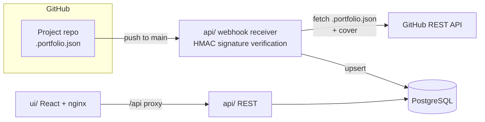

# Portfolio


A full-stack portfolio application that showcases selected GitHub projects, kept in sync automatically through GitHub webhooks.

## Overview

Portfolio content is **synced, not curated**. Any GitHub repository becomes portfolio-eligible by containing a `.portfolio.json` file at its root — a manifest describing the project (name, description, stack, features, cover, ...).

- **API** (`api/`) — Spring Boot REST service receiving webhooks and serving project data
- **UI** (`ui/`) — React single-page application rendering the synced portfolio
- **Database** — PostgreSQL storing project records

## How It Works



1. You push to `main` on a project repo containing `.portfolio.json`
2. GitHub fires a `push` webhook at the API
3. The API verifies the request signature (HMAC) and fetches `.portfolio.json` plus preview assets via the GitHub REST API
4. The project record is upserted into PostgreSQL
5. The UI serves the latest data on next load (with a clearly-labelled demo fallback when the API is unreachable)

### Previews

Hybrid approach:

- **Cover** — one screenshot committed to the project repo, referenced by path in `.portfolio.json` (`cover`, nullable); shown as the card hero image, click opens a zoom viewer
- **Live demo** *(optional)* — a `demo_url` opened as an external link, never embedded (most sites block iframing)

## Tech Stack

| Layer       | Technology                                    |
|-------------|-----------------------------------------------|
| Backend     | Java 25, Spring Boot 4.1, Flyway, JaCoCo gate |
| Frontend    | React 19, TypeScript 6, Vite 8, Tailwind 4    |
| Database    | PostgreSQL 16                                 |
| Integration | GitHub Webhooks (HMAC) + Contents API        |
| Prod serve  | nginx (SPA fallback, `/api` proxy, immutable asset cache) |

## Repository Layout

```
portfolio/
├── api/                        # Spring Boot backend (Java 25, Maven)
│   └── src/main/resources/db/migration/  # Flyway V1..V4
├── ui/                         # React frontend (Vite, TS)
│   ├── Dockerfile + nginx.conf # production image
│   └── src/
├── docker-compose.yml          # db + api + ui
├── .env.example                # all knobs (copy to .env, never commit it)
└── .github/workflows/          # ci.yml (tests, gates, compose smoke) + fallow.yml
```

### Prerequisites

- JDK 25
- Node.js 22+
- Docker & Docker Compose

## Quickstart

```bash
cp .env.example .env   # fill GITHUB_TOKEN / GITHUB_WEBHOOK_SECRET / ADMIN_TOKEN
docker compose up -d --build
```

| Service | URL                       | Notes                              |
|---------|---------------------------|------------------------------------|
| UI      | http://localhost:8083     | nginx; `/api/*` proxied to `api`   |
| API     | http://localhost:8082/api | `API_PORT` sets the host port      |
| DB      | localhost:5432            | `DB_*` credentials in `.env`       |

Health: `GET /api/health` → `{"status":"UP"}`.

Local dev (no compose): `./mvnw test` in `api/` (needs `DB_URL`, Postgres),
`npm run dev` in `ui/` (vite proxies `/api` to `localhost:${API_PORT:-8080}`).
`npm test`, `npm run build`, `npm run lint` in `ui/`; `npx fallow audit` for static analysis.

### Environment

| Variable               | Used by      | Default              | Notes                                      |
|------------------------|--------------|----------------------|--------------------------------------------|
| `API_PORT`             | compose      | `8080`               | **Host** port only; container stays 8080   |
| `UI_PORT`              | compose      | `8083`               | Host port for nginx                        |
| `VITE_API_URL`         | ui build     | empty (same-origin)  | Absolute URL only to bypass proxies        |
| `CORS_ALLOWED_ORIGINS` | api          | `http://localhost:*` | Comma-separated, spaces allowed            |
| `DB_NAME/DB_USER/DB_PASSWORD/DB_PORT` | db+api | `portfolio/.../5432` | Dev defaults; change in prod |
| `GITHUB_TOKEN`         | api          | empty (fail-closed)  | PAT with `Contents:read`                   |
| `GITHUB_WEBHOOK_SECRET`| api          | empty (fail-closed)  | Webhooks rejected when blank               |
| `ADMIN_TOKEN`          | api          | empty (fail-closed)  | Bearer for `/admin/*`; 503 when blank      |
| `GITHUB_API_BASE_URL`  | api          | `https://api.github.com` | Override for stubs/tests               |

## API Surface

| Method | Path                          | Auth            | Notes                                    |
|--------|-------------------------------|-----------------|------------------------------------------|
| GET    | `/api/health`                 | —               | `{"status":"UP"}`                        |
| GET    | `/api/projects`               | —               | Project list (covers as `/cover` URLs)   |
| GET    | `/api/projects/{slug}/cover`  | —               | Binary cover, ETag + hourly cache        |
| POST   | `/api/contact`                | throttle 5/hour | 202 stored / 202 honeypot / 422 / 429    |
| POST   | `/api/webhooks/github`        | HMAC-SHA256     | ping→200, portfolio push→202, else 200   |
| POST   | `/api/admin/sync`             | bearer          | `{"repo":"owner/name","ref?":"main"}`    |
| GET    | `/api/admin/messages`         | bearer          | Latest 50 inbox messages                 |
| PATCH  | `/api/admin/messages/{id}`    | bearer          | Mark message read                        |

## Roadmap

- [x] Define the `.portfolio.json` manifest schema
- [x] Scaffold `api/` (Spring Boot 4 + PostgreSQL + Flyway)
- [x] Scaffold `ui/` (Vite + React + TypeScript)
- [x] Webhook receiver with HMAC signature verification (+ idempotent deliveries)
- [x] Fetch `.portfolio.json` & cover via GitHub Contents API
- [x] Project upsert logic (SHA-idempotent)
- [x] Project list UI with previews
- [x] Wire UI to live API (labelled demo fallback + retry when unreachable)
- [x] Contact inbox (throttled, honeypot, admin read)
- [x] Admin sync + message endpoints (bearer, fail-closed)
- [x] Trilingual UI (en/fr/ar)
- [x] Docker Compose (db + api + nginx UI) for local development
- [x] CI pipeline (API tests + coverage gate, UI tests/build/lint, compose smoke)
